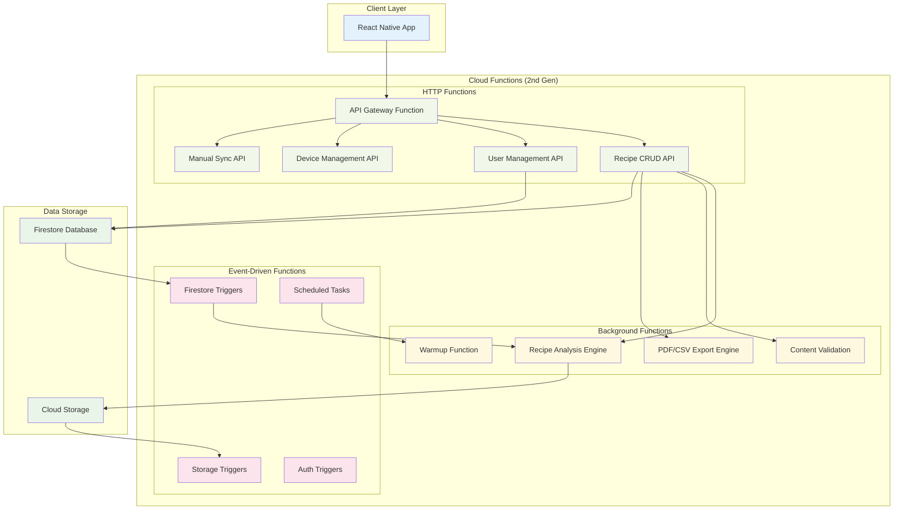

# RecipeCapture モバイルアプリ技術設計書（サーバーレス版）

## 1. システムアーキテクチャ

### 1.1 全体アーキテクチャ（サーバーレス構成）

```mermaid
graph TB
    subgraph "Mobile Client Layer"
        RNApp[React Native App]
        iOSApp[iOS App]
        AndroidApp[Android App]
    end

    subgraph "Firebase Platform"
        FirebaseAuth[Firebase Authentication]
        Firestore[Firebase Firestore]
        Storage[Firebase Storage]
        FCM[Firebase Cloud Messaging]
    end

    subgraph "Serverless Functions Layer"
        AnalysisFunc[Recipe Analysis Function]
        CRUDFunc[CRUD API Functions]
        SyncFunc[Real-time Sync Functions]
        NotificationFunc[Push Notification Function]
        ValidationFunc[Content Validation Function]
        ExportFunc[Export Functions]
        ScheduledFunc[Scheduled Functions]
    end

    subgraph "External APIs"
        YouTubeAPI[YouTube Data API]
        SpeechAPI[GCP Speech-to-Text]
        GeminiAPI[Google Gemini API]
    end

    subgraph "Infrastructure"
        CloudScheduler[Cloud Scheduler]
        CloudLogging[Cloud Logging]
        CloudMonitoring[Cloud Monitoring]
        AppStore[App Store Connect]
        PlayStore[Google Play Console]
    end

    %% Client connections
    RNApp --> iOSApp
    RNApp --> AndroidApp
    RNApp --> FirebaseAuth
    RNApp --> CRUDFunc
    RNApp --> Firestore
    RNApp --> Storage
    RNApp --> FCM

    %% Serverless Functions connections
    CRUDFunc --> AnalysisFunc
    AnalysisFunc --> YouTubeAPI
    AnalysisFunc --> SpeechAPI
    AnalysisFunc --> GeminiAPI
    AnalysisFunc --> ValidationFunc

    %% Firestore Triggers
    Firestore --> SyncFunc
    Firestore --> NotificationFunc
    Storage --> ExportFunc

    %% Scheduled Functions
    CloudScheduler --> ScheduledFunc
    ScheduledFunc --> NotificationFunc

    %% Monitoring
    AnalysisFunc --> CloudLogging
    CRUDFunc --> CloudMonitoring

    %% App Store connections
    iOSApp --> AppStore
    AndroidApp --> PlayStore

    %% Styling
    classDef clientLayer fill:#e1f5fe
    classDef serverlessLayer fill:#f3e5f5
    classDef externalAPI fill:#fff3e0
    classDef database fill:#e8f5e8
    classDef infrastructure fill:#fce4ec

    class RNApp,iOSApp,AndroidApp clientLayer
    class AnalysisFunc,CRUDFunc,SyncFunc,NotificationFunc,ValidationFunc,ExportFunc,ScheduledFunc serverlessLayer
    class YouTubeAPI,SpeechAPI,GeminiAPI externalAPI
    class Firestore,Storage,FirebaseAuth,FCM database
    class CloudScheduler,CloudLogging,CloudMonitoring,AppStore,PlayStore infrastructure
```



### 1.2 Firebase Functions アーキテクチャ



## 2. 技術スタック（サーバーレス特化）

### 2.1 React Native フロントエンド（変更なし）

| 技術               | バージョン | 用途                       |
| ------------------ | ---------- | -------------------------- |
| React Native       | 0.74+      | クロスプラットフォーム開発 |
| TypeScript         | 5.0+       | 型安全性                   |
| Expo               | SDK 51+    | 開発・ビルド・デプロイ     |
| Redux Toolkit      | 2.0+       | 状態管理                   |
| React Navigation   | 6.0+       | ナビゲーション             |
| React Native Paper | 5.0+       | UI コンポーネント          |
| React Hook Form    | 7.0+       | フォーム管理               |
| React Query        | 5.0+       | サーバー状態管理           |

### 2.2 サーバーレス バックエンド

| 技術                          | バージョン | 用途                             |
| ----------------------------- | ---------- | -------------------------------- |
| Firebase Functions            | 2nd Gen    | サーバーレス実行環境             |
| TypeScript                    | 5.0+       | プログラミング言語               |
| Express.js                    | 4.19+      | HTTP Functions内でのルーティング |
| Firebase Admin SDK            | 12.0+      | Firebase操作                     |
| Google Cloud Client Libraries | latest     | 外部API接続                      |

### 2.3 Firebase プラットフォーム

| 技術                         | 用途               | 料金モデル          |
| ---------------------------- | ------------------ | ------------------- |
| Firebase Firestore           | NoSQLデータベース  | 従量課金            |
| Firebase Storage             | ファイルストレージ | 従量課金            |
| Firebase Authentication      | ユーザー認証       | 無料（MAU制限なし） |
| Firebase Cloud Messaging     | プッシュ通知       | 無料                |
| Firebase Functions (2nd Gen) | サーバーレス実行   | 従量課金            |

### 2.4 Google Cloud サービス

| 技術             | 用途           | 料金特性               |
| ---------------- | -------------- | ---------------------- |
| Cloud Scheduler  | 定期実行タスク | 3ジョブまで無料        |
| Cloud Logging    | ログ管理       | 50GB/月まで無料        |
| Cloud Monitoring | 監視・アラート | 150MB/月まで無料       |
| Secret Manager   | API キー管理   | 6アクセス/時間まで無料 |

## 3. プロジェクト構造

### 3.1 Firebase Functions ディレクトリ構成

```
functions/
├── src/
│   ├── api/                    # HTTP Functions（CRUD API）
│   │   ├── routes/
│   │   │   ├── recipes.ts     # レシピCRUD
│   │   │   ├── users.ts       # ユーザー管理
│   │   │   ├── devices.ts     # デバイス管理
│   │   │   └── sync.ts        # 手動同期API
│   │   ├── middleware/        # 認証・バリデーション
│   │   └── index.ts           # API Gateway
│   ├── analysis/              # 解析エンジン
│   │   ├── youtube.ts         # YouTube API連携
│   │   ├── speech.ts          # Speech-to-Text
│   │   ├── gemini.ts          # Gemini API連携
│   │   ├── validation.ts      # コンテンツ検証
│   │   └── index.ts           # 解析メイン処理
│   ├── triggers/              # イベントドリブン処理
│   │   ├── firestore.ts       # Firestoreトリガー
│   │   ├── storage.ts         # Storageトリガー
│   │   ├── auth.ts            # 認証トリガー
│   │   └── index.ts           # トリガー統合
│   ├── scheduled/             # 定期実行タスク
│   │   ├── warmup.ts          # Warmup処理
│   │   ├── statistics.ts      # 統計処理
│   │   ├── cleanup.ts         # クリーンアップ
│   │   └── index.ts           # スケジュール統合
│   ├── services/              # 共通サービス
│   │   ├── firestore.ts       # Firestore操作
│   │   ├── storage.ts         # Storage操作
│   │   ├── notifications.ts   # プッシュ通知
│   │   ├── export.ts          # PDF/CSV生成
│   │   └── sync.ts            # データ同期
│   ├── utils/                 # ユーティリティ
│   │   ├── validation.ts      # バリデーション
│   │   ├── errors.ts          # エラーハンドリング
│   │   ├── constants.ts       # 定数
│   │   └── helpers.ts         # ヘルパー関数
│   ├── types/                 # TypeScript型定義
│   │   ├── api.ts             # API型定義
│   │   ├── recipe.ts          # レシピ型定義
│   │   └── user.ts            # ユーザー型定義
│   └── index.ts               # Functions エントリーポイント
├── package.json
├── tsconfig.json
└── firebase.json              # Firebase設定
```

### 3.2 React Native アプリ構造

```
src/
├── components/           # 再利用可能コンポーネント
│   ├── common/          # 汎用コンポーネント
│   ├── forms/           # フォームコンポーネント
│   └── recipe/          # レシピ関連コンポーネント
├── screens/             # 画面コンポーネント
│   ├── app.tsx         # エントリーポイント
│   ├── auth/           # 認証画面
│   ├── analysis/       # 解析画面
│   ├── recipe/         # レシピ管理画面
│   └── settings/       # 設定画面
├── navigation/          # ナビゲーション設定
├── store/              # Redux状態管理
│   ├── slices/         # Redux slices
│   └── api/            # RTK Query APIs
├── services/           # API・外部サービス（Functions呼び出し）
├── utils/              # ユーティリティ
├── constants/          # 定数
├── types/              # TypeScript型定義
└── assets/             # 画像・フォント等
```

## 4. サーバーレス特有の設定

### 4.1 Firebase Functions 設定

```json
// firebase.json
{
  "functions": [
    {
      "source": "functions",
      "codebase": "default",
      "runtime": "nodejs20",
      "ignore": [
        "node_modules",
        ".git",
        "firebase-debug.log",
        "firebase-debug.*.log"
      ],
      "predeploy": [
        "npm --prefix \"$RESOURCE_DIR\" run lint",
        "npm --prefix \"$RESOURCE_DIR\" run build"
      ]
    }
  ],
  "firestore": {
    "rules": "firestore.rules",
    "indexes": "firestore.indexes.json"
  },
  "storage": {
    "rules": "storage.rules"
  },
  "emulators": {
    "functions": {
      "port": 5001
    },
    "firestore": {
      "port": 8080
    },
    "storage": {
      "port": 9199
    },
    "ui": {
      "enabled": true,
      "port": 4000
    }
  }
}
```

### 4.2 Functions パッケージ設定

```json
// functions/package.json
{
  "name": "recipe-capture-functions",
  "version": "1.0.0",
  "engines": {
    "node": "20"
  },
  "scripts": {
    "build": "tsc",
    "build:watch": "tsc --watch",
    "serve": "npm run build && firebase emulators:start --only functions",
    "shell": "npm run build && firebase functions:shell",
    "start": "npm run shell",
    "deploy": "firebase deploy --only functions",
    "logs": "firebase functions:log",
    "lint": "eslint src --ext .js,.ts",
    "lint:fix": "eslint src --ext .js,.ts --fix"
  },
  "dependencies": {
    "firebase-admin": "^12.0.0",
    "firebase-functions": "^5.0.0",
    "express": "^4.19.0",
    "cors": "^2.8.5",
    "joi": "^17.12.0",
    "axios": "^1.6.0",
    "@google-cloud/speech": "^6.0.0",
    "@google-cloud/storage": "^7.7.0",
    "puppeteer": "^21.0.0",
    "jspdf": "^2.5.0",
    "csv-writer": "^1.6.0"
  },
  "devDependencies": {
    "@types/express": "^4.17.21",
    "@types/cors": "^2.8.17",
    "@typescript-eslint/eslint-plugin": "^7.0.0",
    "@typescript-eslint/parser": "^7.0.0",
    "eslint": "^8.57.0",
    "typescript": "^5.3.0"
  }
}
```

### 4.3 環境変数・Secret管理

```typescript
// functions/src/config/index.ts
import { defineSecret } from "firebase-functions/params";

// Secret Manager経由でAPI キーを管理
export const YOUTUBE_API_KEY = defineSecret("YOUTUBE_API_KEY");
export const GEMINI_API_KEY = defineSecret("GEMINI_API_KEY");

// 環境設定
export const config = {
  region: "asia-northeast1",
  youtube: {
    apiKey: YOUTUBE_API_KEY,
    maxVideoDuration: 3600, // 1時間
    allowedChannels: [], // 将来的な制限用
  },
  gemini: {
    apiKey: GEMINI_API_KEY,
    model: "gemini-1.5-flash",
    maxTokens: 8192,
  },
  analysis: {
    maxRetries: 3,
    timeoutMinutes: 9,
  },
  storage: {
    exportBucket: "recipe-exports",
    tempBucket: "recipe-temp",
  },
};
```

## 5. デプロイ・CI/CD

### 5.1 デプロイスクリプト

```bash
#!/bin/bash
# deploy.sh

echo "Deploying Firebase Functions..."

# 環境変数の設定
firebase functions:config:set \
  app.environment="production" \
  app.region="asia-northeast1"

# Secretsの設定
firebase functions:secrets:set YOUTUBE_API_KEY
firebase functions:secrets:set GEMINI_API_KEY

# Functions のデプロイ
firebase deploy --only functions

# Firestore rules とindexes のデプロイ
firebase deploy --only firestore:rules,firestore:indexes

echo "Deployment completed!"
```

### 10.2 GitHub Actions CI/CD

```yaml
# .github/workflows/deploy.yml
name: Deploy Firebase Functions

on:
  push:
    branches: [main]
  pull_request:
    branches: [main]

jobs:
  test:
    runs-on: ubuntu-latest
    steps:
      - uses: actions/checkout@v3
      - name: Setup Node.js
        uses: actions/setup-node@v3
        with:
          node-version: "20"
      - name: Install dependencies
        run: |
          cd functions
          npm ci
      - name: Run tests
        run: |
          cd functions
          npm run test
      - name: Run linting
        run: |
          cd functions
          npm run lint

  deploy:
    if: github.ref == 'refs/heads/main'
    needs: test
    runs-on: ubuntu-latest
    steps:
      - uses: actions/checkout@v3
      - name: Setup Node.js
        uses: actions/setup-node@v3
        with:
          node-version: "20"
      - name: Install Firebase CLI
        run: npm install -g firebase-tools
      - name: Deploy to Firebase
        run: |
          cd functions
          npm ci
          npm run build
          firebase deploy --only functions --token ${{ secrets.FIREBASE_TOKEN }}
        env:
          FIREBASE_TOKEN: ${{ secrets.FIREBASE_TOKEN }}
```
